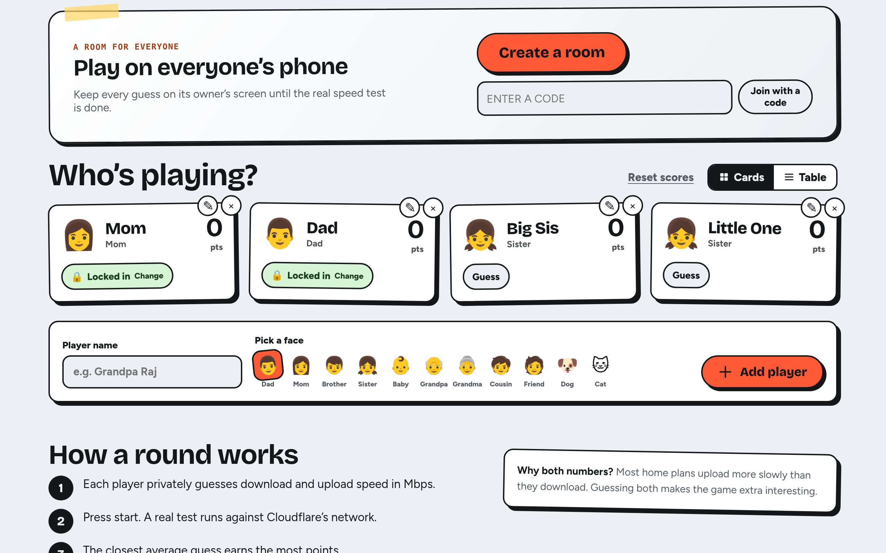
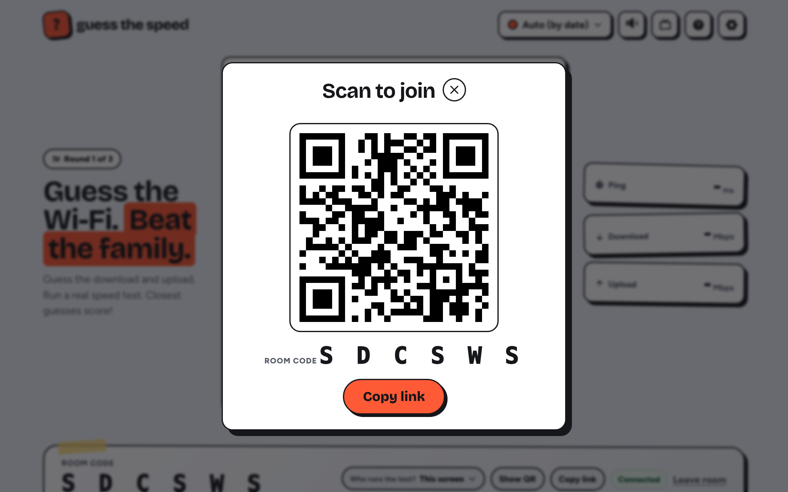
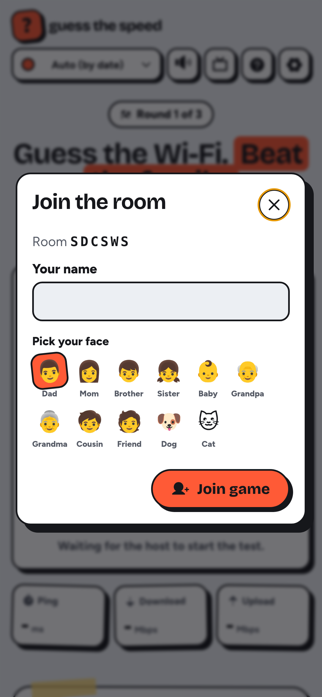
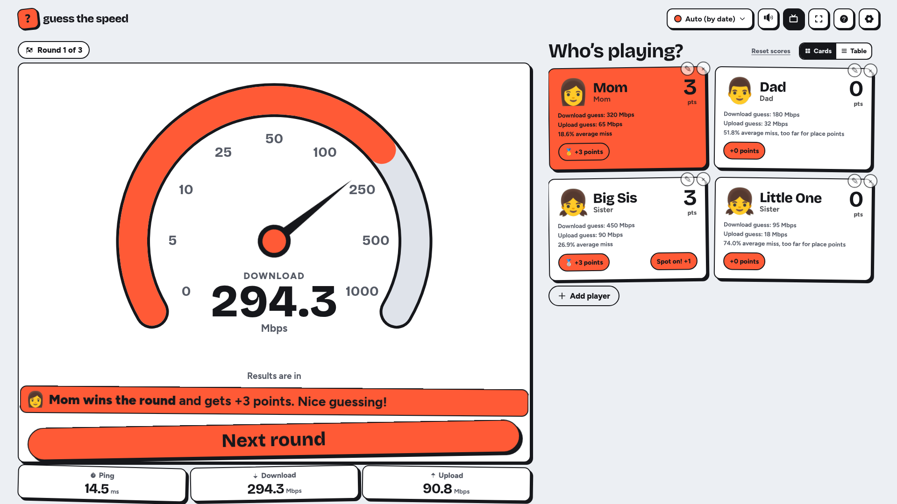
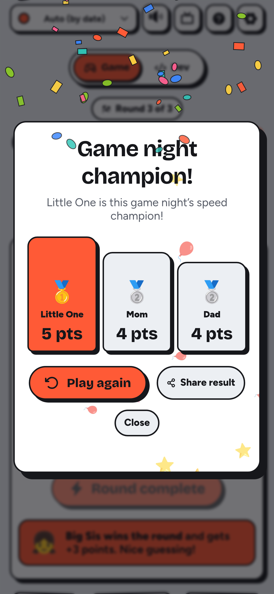
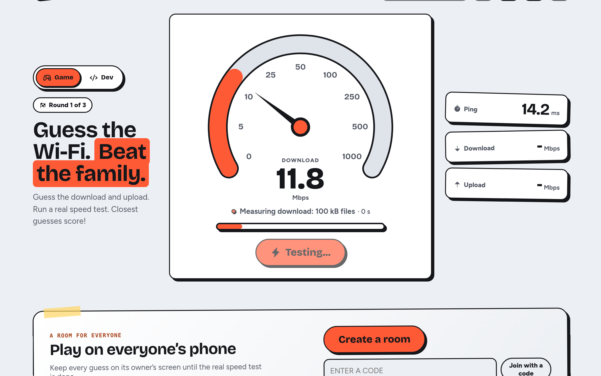
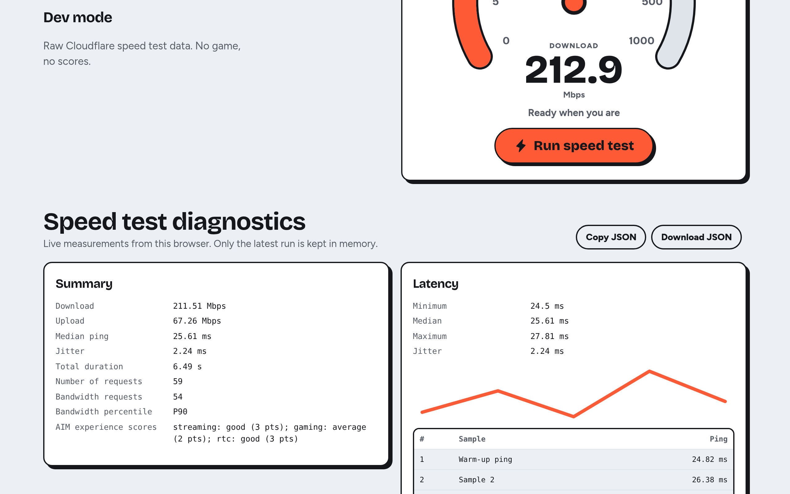
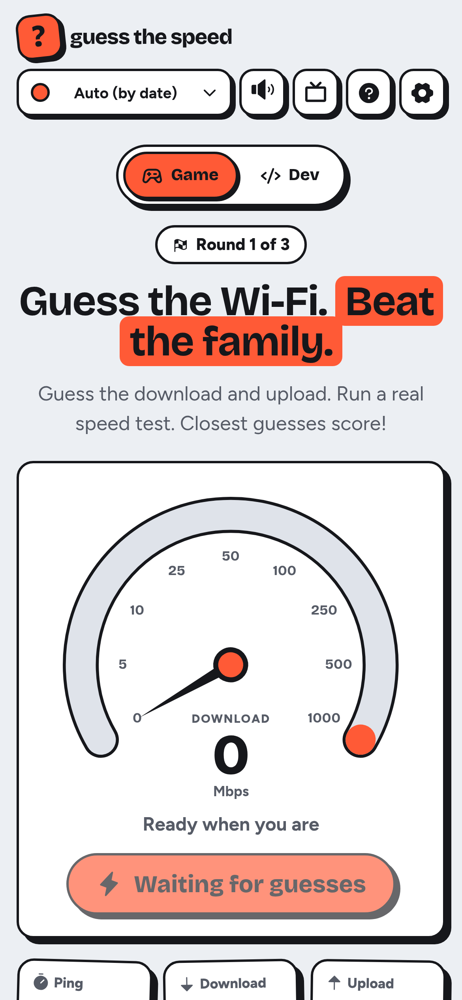
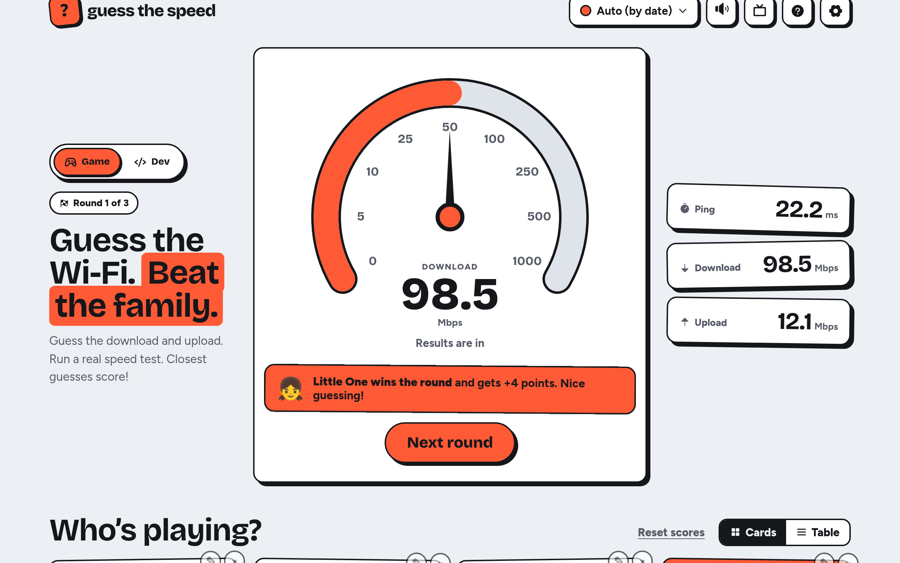

<div align="center">
  
  <h1>Guess the Speed</h1>
  <p><strong>The internet speed guessing game for families. Guess the Wi-Fi. Beat the family.</strong></p>
  <p>
    <a href="https://guessthespeed.com/"></a>
    <a href="https://astro.build/"></a>
    <a href="https://developers.cloudflare.com/workers/"></a>
    <a href="https://www.typescriptlang.org/"></a>
  </p>
  <p>
    <a href="https://guessthespeed.com/">Play now</a> ·
    <a href="https://guessthespeed.com/how-to-play/">How to play</a> ·
    <a href="https://guessthespeed.com/story/">Our story</a> ·
    <a href="https://guessthespeed.com/internet-speed-101/">Speed guides</a>
  </p>
</div>

<p align="center">
  
</p>

## Why this exists

Speed test nights on the living-room TV became our family game night, with everyone shouting a guess before I press go. My kids get it right every time, and Dad loses on purpose. I started out in performance testing, moved into development, and turned that ritual into a game other families can play; [here is the story](https://guessthespeed.com/story/).

## How a round works

1. Add players and choose a face for each one.
2. Everyone locks a secret download and upload guess.
3. Run a real speed test against Cloudflare's network.
4. Compare guesses with the result and score the closest players.

## Features

<table>
  <tr>
    <td width="50%" valign="top">
      
      <p><strong>Room codes for everyone's phones</strong><br>Start a room with a six-letter code or QR and invite up to 12 players. The server keeps guesses private until results, and the host chooses which device runs the test.</p>
    </td>
    <td width="50%" valign="top">
      
      <p><strong>Join from a phone</strong><br>Enter the room code, pick a name and face, and send a private guess from your own screen.</p>
    </td>
  </tr>
  <tr>
    <td width="50%" valign="top">
      
      <p><strong>TV mode for the living room</strong><br>Switch to a larger gauge and text, with fullscreen controls and a screen wake lock where the browser supports it.</p>
    </td>
    <td width="50%" valign="top">
      
      <p><strong>Share the winner</strong><br>The champion dialog puts the winner and scores beside a Share result button. It uses the device share sheet or copies a link.</p>
    </td>
  </tr>
  <tr>
    <td width="50%" valign="top">
      
      <p><strong>A live gauge with clear stages</strong><br>Follow the test through ping, download, and upload with live values and result cards.</p>
    </td>
    <td width="50%" valign="top">
      
      <p><strong>Dev diagnostics</strong><br>Inspect the summary, latency samples, individual test requests, bandwidth percentile, test plan, and browser details. Copy or download the latest run as JSON.</p>
    </td>
  </tr>
  <tr>
    <td width="50%" valign="top">
      
      <p><strong>Ready for a small screen</strong><br>The gauge, controls, and player cards reflow for a phone, with touch-sized buttons.</p>
    </td>
    <td width="50%" valign="top">
      
      <p><strong>Festive themes</strong><br>Choose light, dark, or seasonal themes, or leave Auto (by date) on to follow the calendar.</p>
    </td>
  </tr>
</table>

## Scoring

| Rule          | How it works                                                                                     |
| ------------- | ------------------------------------------------------------------------------------------------ |
| Place points  | First place earns 3 points, second place 2, and third place 1.                                   |
| Spot-on bonus | Earn +1 point for each download or upload guess within 5% of its measured speed.                 |
| 50% cutoff    | An average miss over 50% earns no place points; the next closest eligible guess moves up.        |
| Ties          | Shared points are the default; the alternate tie-break compares download miss, then upload miss. |
| Rounds        | Three rounds by default, with set-length and endless options.                                    |

## Privacy by design

- Single-screen game settings, player names, and scores stay in this browser's local storage.
- Room names, faces, guesses, and scores are deleted after six hours without activity.
- The play counter stores totals only. Cloudflare Web Analytics is cookieless.
- Sharing uses your device's share sheet or clipboard.
- The speed test runs in your browser against Cloudflare's network.

Read the [privacy page](https://guessthespeed.com/privacy/).

## Guides on the site

- [Family game night ideas that use your Wi-Fi](https://guessthespeed.com/family-game-night-ideas/)
- [How does the real speed test work?](https://guessthespeed.com/how-it-works/)
- [How Much Internet Speed Do I Need?](https://guessthespeed.com/how-much-internet-speed-do-i-need/)
- [How do you play Guess the Speed?](https://guessthespeed.com/how-to-play/)
- [Internet speed 101](https://guessthespeed.com/internet-speed-101/)
- [Internet speed lesson for kids: a 30-minute classroom activity](https://guessthespeed.com/internet-speed-lesson-for-kids/)
- [Mbps to MB/s Converter](https://guessthespeed.com/mbps-to-mbs/)
- [The speed test guessing game](https://guessthespeed.com/speed-test-game/)
- [What Is a Good Internet Speed in 2026?](https://guessthespeed.com/what-is-a-good-internet-speed/)

## How it's built

- **Astro and TypeScript** serve the static site on Cloudflare Workers.
- **`@cloudflare/speedtest`** measures the connection in the browser.
- **`GameRoom` Durable Object** manages multiplayer rooms with WebSocket hibernation; **`PlayStats`** keeps the aggregate play counter.
- **Game and scoring rules** live in `src/lib` and are covered by Vitest.

```text
src/
  lib/       game, scoring, room, and speed-test logic
  pages/     the game, guides, story, and privacy page
  scripts/   browser interactions
  styles/    themes and responsive layout
worker/      GameRoom and PlayStats Durable Objects
public/      icons and static assets
```

## Local development

```sh
npm install
npm run dev
```

Use the Worker locally to exercise rooms and play stats:

```sh
npm run dev:worker
```

Useful commands:

```sh
npm run check
npm test
npm run format
npm run format:check
npm run build
npm run preview
```

For a short simulated speed test, append `?mock=1`. Use `?dev=1` to open Dev diagnostics or `?tv=1` to use the TV layout.

## Deploy

Deploy with Cloudflare Workers Builds. `wrangler.jsonc` runs `npm run build` before `npx wrangler deploy` and uploads `dist` as static assets, so the dashboard build command can stay empty. Durable Object migrations for `GameRoom` and `PlayStats` run as part of the deploy.

To enable optional Cloudflare Web Analytics, configure `PUBLIC_CF_BEACON_TOKEN` in the Cloudflare build environment. Without the token, the analytics beacon is not included.

<div align="center">
  <p>Made by NaveenKumar Namachivayam (<a href="https://qainsights.com">QAInsights</a>)</p>
  <p>
    <a href="https://github.com/QAInsights/guessthespeed">GitHub</a> ·
    <a href="https://dosa.dev">dosa.dev</a> ·
    <a href="https://iamspeed.dev">iamspeed.dev</a> ·
    <a href="https://buymeacoffee.com/qainsights">Buy me a coffee</a>
  </p>
</div>
